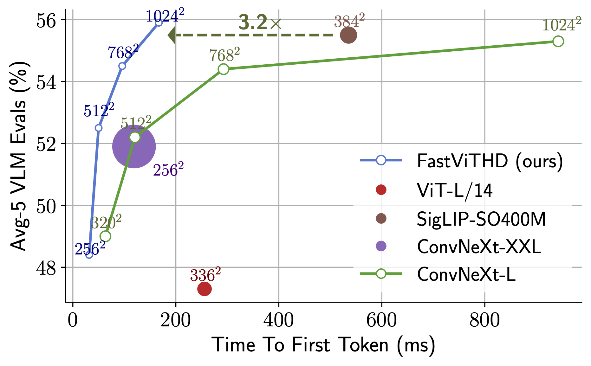
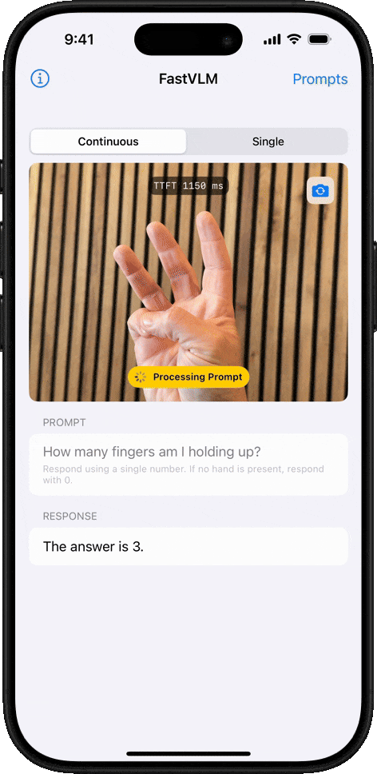
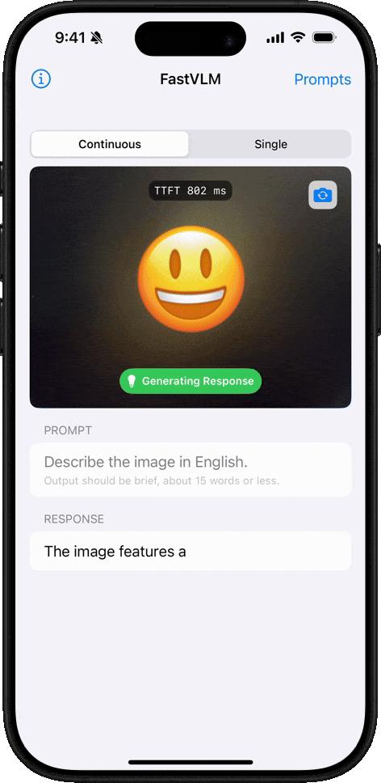

# FastVLM: Efficient Vision Encoding for Vision Language Models

This is the official repository of
**[FastVLM: Efficient Vision Encoding for Vision Language Models](https://www.arxiv.org/abs/2412.13303). (CVPR 2025)**

[//]: # (![FastViTHD Performance]&#40;docs/acc_vs_latency_qwen-2.png&#41;)
<p align="center">

</p>

### Highlights
* We introduce FastViTHD, a novel hybrid vision encoder designed to output fewer tokens and significantly reduce encoding time for high-resolution images.  
* Our smallest variant outperforms LLaVA-OneVision-0.5B with 85x faster Time-to-First-Token (TTFT) and 3.4x smaller vision encoder.
* Our larger variants using Qwen2-7B LLM outperform recent works like Cambrian-1-8B while using a single image encoder with a 7.9x faster TTFT.
* Demo iOS app to demonstrate the performance of our model on a mobile device.

<table>
<tr>
    <td></td>
    <td></td>
    <td></td>
</tr>
</table>

## Getting Started
We use LLaVA codebase to train FastVLM variants. In order to train or finetune your own variants, 
please follow instructions provided in [LLaVA](https://github.com/haotian-liu/LLaVA) codebase. 
We provide instructions for running inference with our models.   

### Setup
```bash
conda create -n fastvlm python=3.10
conda activate fastvlm
pip install -e .
```

### Model Zoo
For detailed information on various evaluations, please refer to our [paper](https://www.arxiv.org/abs/2412.13303).

| Model        | Stage |                                            Pytorch Checkpoint (url)                                             |
|:-------------|:-----:|:---------------------------------------------------------------------------------------------------------------:|
| FastVLM-0.5B |   2   | [fastvlm_0.5b_stage2](https://ml-site.cdn-apple.com/datasets/fastvlm/llava-fastvithd_0.5b_stage2.zip) |
|              |   3   | [fastvlm_0.5b_stage3](https://ml-site.cdn-apple.com/datasets/fastvlm/llava-fastvithd_0.5b_stage3.zip) |
| FastVLM-1.5B |   2   | [fastvlm_1.5b_stage2](https://ml-site.cdn-apple.com/datasets/fastvlm/llava-fastvithd_1.5b_stage2.zip) |
|              |   3   | [fastvlm_1.5b_stage3](https://ml-site.cdn-apple.com/datasets/fastvlm/llava-fastvithd_1.5b_stage3.zip)  |
| FastVLM-7B   |   2   | [fastvlm_7b_stage2](https://ml-site.cdn-apple.com/datasets/fastvlm/llava-fastvithd_7b_stage2.zip)  |
|              |   3   | [fastvlm_7b_stage3](https://ml-site.cdn-apple.com/datasets/fastvlm/llava-fastvithd_7b_stage3.zip)  |

To download all the pretrained checkpoints run the command below (note that this might take some time depending on your connection so might be good to grab ☕️ while you wait).

```bash
bash get_models.sh   # Files will be downloaded to `checkpoints` directory.
```

### Usage Example
To run inference of PyTorch checkpoint, follow the instruction below
```bash
python predict.py --model-path /path/to/checkpoint-dir \
                  --image-file /path/to/image.png \
                  --prompt "Describe the image."
```

### Inference on Apple Silicon
To run inference on Apple Silicon, pytorch checkpoints have to be exported to format 
suitable for running on Apple Silicon, detailed instructions and code can be found [`model_export`](model_export/) subfolder.
Please see the README there for more details.

For convenience, we provide 3 models that are in Apple Silicon compatible format: [fastvlm_0.5b_stage3](https://ml-site.cdn-apple.com/datasets/fastvlm/llava-fastvithd_0.5b_stage3_llm.fp16.zip), 
[fastvlm_1.5b_stage3](https://ml-site.cdn-apple.com/datasets/fastvlm/llava-fastvithd_1.5b_stage3_llm.int8.zip), 
[fastvlm_7b_stage3](https://ml-site.cdn-apple.com/datasets/fastvlm/llava-fastvithd_7b_stage3_llm.int4.zip). 
We encourage developers to export the model of their choice with the appropriate quantization levels following 
the instructions in [`model_export`](model_export/).

### Inference on Apple Devices
To run inference on Apple devices like iPhone, iPad or Mac, see [`app`](app/) subfolder for more details.

## Citation
If you found this code useful, please cite the following paper:
```
@InProceedings{fastvlm2025,
  author = {Pavan Kumar Anasosalu Vasu, Fartash Faghri, Chun-Liang Li, Cem Koc, Nate True, Albert Antony, Gokul Santhanam, James Gabriel, Peter Grasch, Oncel Tuzel, Hadi Pouransari},
  title = {FastVLM: Efficient Vision Encoding for Vision Language Models},
  booktitle = {Proceedings of the IEEE/CVF Conference on Computer Vision and Pattern Recognition (CVPR)},
  month = {June},
  year = {2025},
}
```

## Acknowledgements
Our codebase is built using multiple opensource contributions, please see [ACKNOWLEDGEMENTS](ACKNOWLEDGEMENTS) for more details. 

## License
Please check out the repository [LICENSE](LICENSE) before using the provided code and
[LICENSE_MODEL](LICENSE_MODEL) for the released models.

# 实时图像描述系统

这是一个基于 FastVLM 的实时图像描述系统，支持实时图像捕获和描述。

## 系统架构

系统分为两个主要部分：

1. 客户端（树莓派）
   - 负责图像捕获
   - 提供 Web 界面
   - 通过 WebSocket 与服务器通信

2. 服务端（Ubuntu 服务器）
   - 运行 FastVLM 模型
   - 处理图像描述请求
   - 通过 WebSocket 返回结果

## 日志系统

系统使用 Python 的 logging 模块进行日志记录，日志文件保存在用户目录下的 `ml-fastvlm-logs` 文件夹中：

- 客户端日志：`~/ml-fastvlm-logs/client.log`
- 服务端日志：`~/ml-fastvlm-logs/server.log`

日志特点：
- 自动按大小轮转（每个文件最大 10MB）
- 保留最近 5 个日志文件
- 同时输出到控制台和文件
- 包含时间戳和日志级别
- 使用表情符号提高可读性

日志级别：
- INFO：正常运行信息
- ERROR：错误和异常信息

## 部署说明

### 服务端（Ubuntu）

1. 安装依赖：
```bash
pip install -r requirements.txt
```

2. 启动服务：
```bash
python start_socket_service_fastvlm.py
```

服务将在 `http://服务器IP:5000` 上运行。

### 客户端（树莓派）

1. 安装依赖：
```bash
pip install -r client/requirements.txt
```

2. 启动客户端：
```bash
python client/app.py
```

客户端将在 `http://树莓派IP:8080` 上运行。

## 监控和故障排除

1. 查看日志：
```bash
# 查看客户端日志
tail -f ~/ml-fastvlm-logs/client.log

# 查看服务端日志
tail -f ~/ml-fastvlm-logs/server.log
```

2. 常见问题：
   - 如果连接失败，检查日志中的错误信息
   - 如果模型加载失败，检查 CUDA 和模型文件
   - 如果图片处理失败，检查图片格式和大小

3. 性能监控：
   - 日志中记录了图片大小和处理时间
   - 可以监控 WebSocket 连接状态
   - 可以查看模型加载和运行状态

## 配置说明

### 客户端配置

在 `client/app.py` 中：
- `IMAGE_WIDTH`：压缩后的图片宽度
- `IMAGE_QUALITY`：JPEG 压缩质量（0-100）

### 服务端配置

在 `start_socket_service_fastvlm.py` 中：
- 模型参数配置
- WebSocket 连接设置
- 日志配置

## 许可证

MIT License
